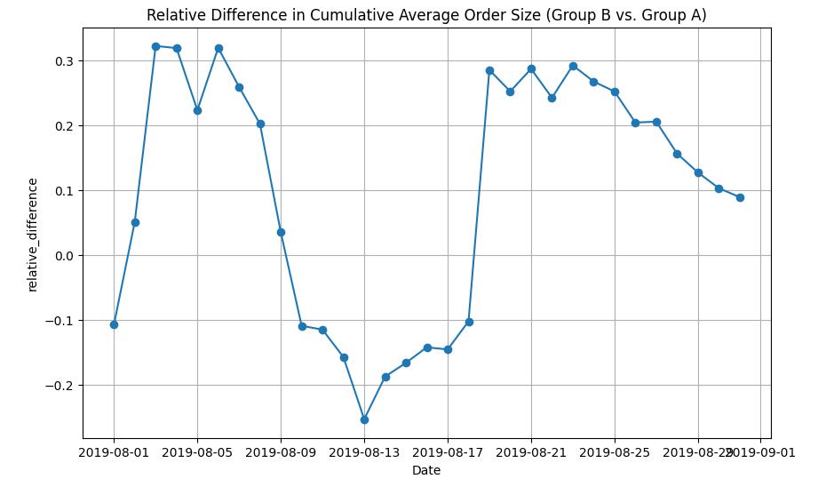
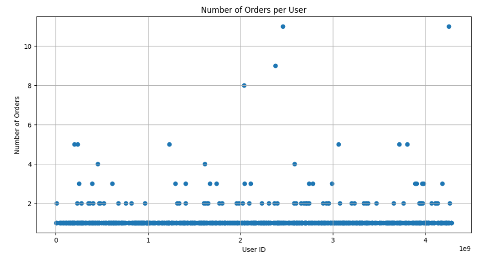
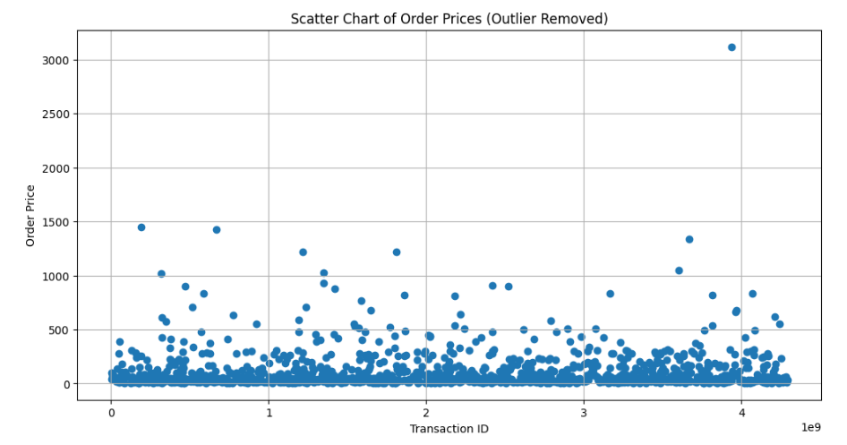

# A/B Testing

## Overview
- A/B Testing of an Online Company testing to increase their revenue with different types of hypothesis.

## What is the reason for the project
- Find the coorelation between two groups for future advertising
- Test different hypothesis for two groups in regards to revenue
- Find the average order and spent per user

## Images

## Conclusion
- Found the average order price per user
- The average order size, changes overtime for both groups.
- The cummulative revenue from both groups are nearly the same most of the time besides the first month.

## Technologies
- This was written Jupyter Notebook, matplotlib and Python.
